# 🛡️ Main System Architecture (High Readability 16:9)

The previous diagram compressed the text because it tried to draw dozens of tiny individual boxes inside subgraphs. 

To make this **incredibly bold and readable** for a PowerPoint slide, I have consolidated the entire architecture into 5 massive, high-contrast layer blocks. The text will now render huge, allowing anyone in the back of the room to easily read the modules.

Copy this code and throw it into [Mermaid Live Editor](https://mermaid.live).

```mermaid
flowchart LR
    %% Define Massive Text Styles
    classDef L1 fill:#E3F2FD,stroke:#1565C0,stroke-width:3px,color:#0D47A1,font-size:20px
    classDef L2 fill:#E8F5E9,stroke:#2E7D32,stroke-width:3px,color:#1B5E20,font-size:20px
    classDef L3 fill:#FFF3E0,stroke:#EF6C00,stroke-width:3px,color:#E65100,font-size:20px
    classDef L4 fill:#F3E5F5,stroke:#6A1B9A,stroke-width:3px,color:#4A148C,font-size:20px
    classDef L5 fill:#FFEBEE,stroke:#C62828,stroke-width:3px,color:#B71C1C,font-size:20px

    %% -------------------------------------
    %% BIG BOLD LAYER BLOCKS
    %% -------------------------------------
    Monitor["<b>LAYER 1: NATIVE MONITOR</b><hr/>• Watchdog Observer<br/>• File Event Handler<br/>• Ransomware Simulator"]:::L1

    Extract["<b>LAYER 2: EXTRACTION</b><hr/>• Shannon Entropy Math<br/>• Rename Frequency Window<br/>• I/O Speed Tracker"]:::L2

    ML["<b>LAYER 3: ML CLASSIFIER</b><hr/>• Random Forest Engine<br/>• Data Normalization<br/>• SHAP Explainer Matrices"]:::L3

    Forensics["<b>LAYER 4: BLOCKCHAIN</b><hr/>• Passive Audit Logging<br/>• SHA-256 Security Hashes<br/>• Exact Millisecond Sync"]:::L4

    UI["<b>LAYER 5: DASHBOARD</b><hr/>• Streamlit Subsystem<br/>• JSON Timeline Plots<br/>• Plyer Desktop Alerts"]:::L5

    %% -------------------------------------
    %% THICK HORIZONTAL CONNECTIONS
    %% -------------------------------------
    Monitor ===>|Intercepts Events| Extract
    Extract ===>|Normalized Vectors| ML
    ML ===>|Triggers Alert| Forensics
    Forensics ===>|Validates Logs| UI

```

