# 🔄 System Workflow Diagram (High Readability 16:9)

To ensure this workflow is entirely readable on a projector screen, I have stripped out the excessive explanatory text from the node bubbles and simplified the decision gates. This will cause the text inside the Mermaid diagram to scale up massively, producing a sharp, clean flowchart!

Copy this Mermaid code and paste it into [Mermaid Live Editor](https://mermaid.live).

```mermaid
flowchart LR
    %% Define Clean Bold Presentation Styles
    classDef startNode fill:#1e1e1e,stroke:#4CAF50,stroke-width:3px,color:#fff,shape:pill,font-size:18px
    classDef process fill:#E3F2FD,stroke:#1565C0,stroke-width:3px,color:#000,font-size:18px
    classDef decision fill:#FFF3E0,stroke:#EF6C00,stroke-width:3px,color:#E65100,shape:diamond,font-size:18px
    classDef alert fill:#FFEBEE,stroke:#C62828,stroke-width:3px,color:#B71C1C,font-size:18px
    classDef safe fill:#E8F5E9,stroke:#2E7D32,stroke-width:3px,color:#1B5E20,font-size:18px
    classDef blockui fill:#F3E5F5,stroke:#6A1B9A,stroke-width:3px,color:#4A148C,font-size:18px

    %% INITIALIZATION
    START([START]):::startNode --> T[Train ML Model]:::process
    T --> W[Start Watchdog]:::process

    %% DETECTION ENGINE
    W --> EDecision{File<br/>Event?}:::decision
    EDecision -- YES --> EF[Extract File Features]:::process
    EF --> RFP[RF Classifier Prediction]:::process
    
    EDecision -. NO .-> EDecision

    %% THREAT EVALUATION
    RFP --> RDecision{Malicious?}:::decision

    %% Benign Path
    RDecision -- NO --> LB[Log: Benign Event]:::safe
    
    %% Alert Path
    RDecision -- YES --> FA[Fire System Alert]:::alert
    FA --> SH[Extract SHAP Matrix]:::alert

    %% DIGITAL FORENSICS
    SH --> LOG[Log to Blockchain]:::blockui
    LOG --> VFC[Verify Audit Chain]:::blockui
    VFC --> DN[Push UI Notification]:::blockui
    DN --> SD[Update Streamlit UX]:::blockui

    %% FINAL LOOP
    SD --> NEXT((Next Event)):::startNode
    LB --> NEXT
    NEXT -.-> EDecision

```

