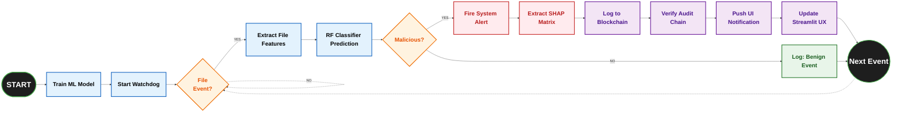

# 🔄 System Workflow Diagram

```mermaid
flowchart LR
    %% Define Clean Bold Presentation Styles
    classDef startNode fill:#1e1e1e,stroke:#4CAF50,stroke-width:3px,color:#fff,shape:pill,font-size:18px
    classDef process fill:#E3F2FD,stroke:#1565C0,stroke-width:3px,color:#000,font-size:18px
    classDef decision fill:#FFF3E0,stroke:#EF6C00,stroke-width:3px,color:#E65100,shape:diamond,font-size:18px
    classDef alert fill:#FFEBEE,stroke:#C62828,stroke-width:3px,color:#B71C1C,font-size:18px
    classDef safe fill:#E8F5E9,stroke:#2E7D32,stroke-width:3px,color:#1B5E20,font-size:18px
    classDef blockui fill:#F3E5F5,stroke:#6A1B9A,stroke-width:3px,color:#4A148C,font-size:18px

    %% INITIALIZATION
    START(["<h1>START</h1>"]):::startNode --> T["<h2>Train ML Model</h2>"]:::process
    T --> W["<h2>Start Watchdog</h2>"]:::process

    %% DETECTION ENGINE
    W --> EDecision{"<h2>File<br/>Event?</h2>"}:::decision
    EDecision -- YES --> EF["<h2>Extract File Features</h2>"]:::process
    EF --> RFP["<h2>RF Classifier Prediction</h2>"]:::process
    
    EDecision -. NO .-> EDecision

    %% THREAT EVALUATION
    RFP --> RDecision{"<h2>Malicious?</h2>"}:::decision

    %% Benign Path
    RDecision -- NO --> LB["<h2>Log: Benign Event</h2>"]:::safe
    
    %% Alert Path
    RDecision -- YES --> FA["<h2>Fire System Alert</h2>"]:::alert
    FA --> SH["<h2>Extract SHAP Matrix</h2>"]:::alert

    %% DIGITAL FORENSICS
    SH --> LOG["<h2>Log to Blockchain</h2>"]:::blockui
    LOG --> VFC["<h2>Verify Audit Chain</h2>"]:::blockui
    VFC --> DN["<h2>Push UI Notification</h2>"]:::blockui
    DN --> SD["<h2>Update Streamlit UX</h2>"]:::blockui

    %% FINAL LOOP
    SD --> NEXT(("<h1>Next Event</h1>")):::startNode
    LB --> NEXT
    NEXT -.-> EDecision

```
